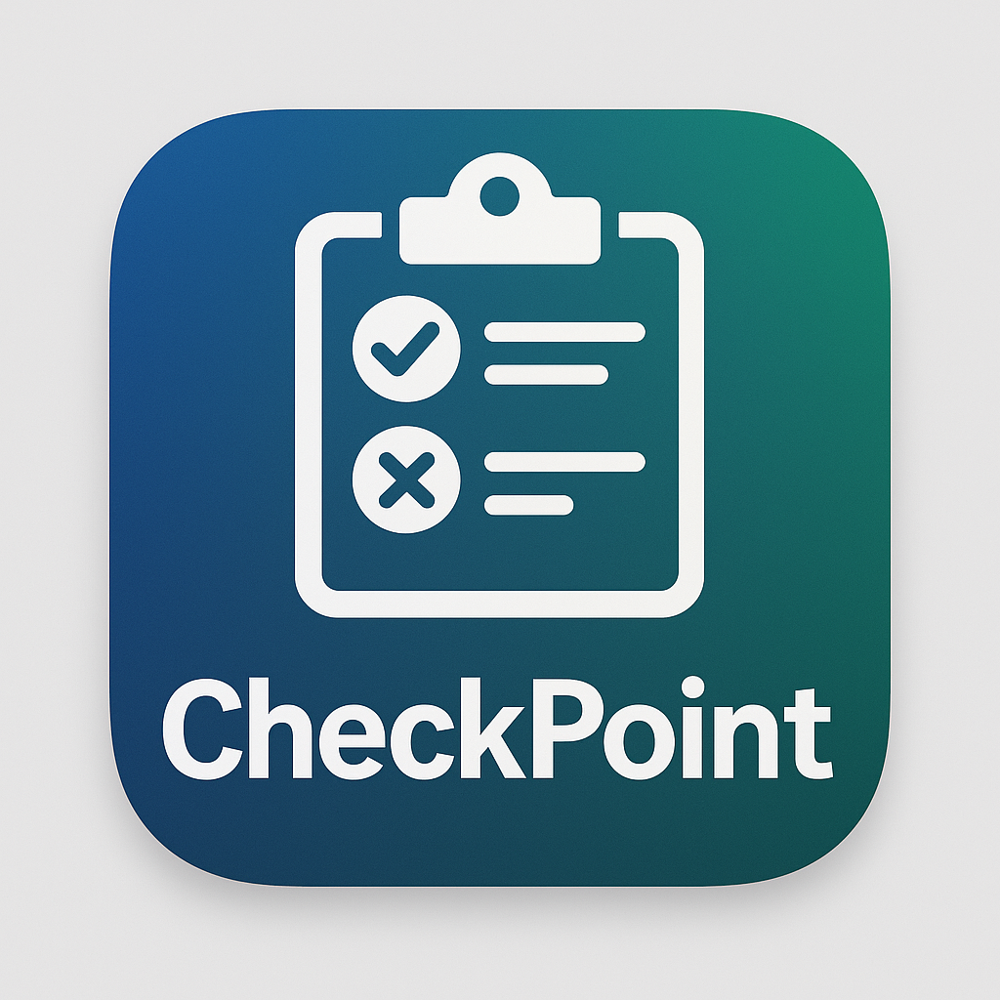

# CheckPoint

<p align="center">
  
</p>

**CheckPoint** is a fast, offline-first attendance spot-check app for teachers. Instead of calling roll for an entire class, randomly sample a few students each session while ensuring previously absent students are automatically rechecked.

## Features

- **Quick Picks** — Select N random students in seconds
- **Smart Carryovers** — Absent students reappear until marked present
- **Multi-Class** — Manage multiple classes with separate rosters and history
- **Offline-First** — Works entirely in the browser with no internet required
- **CSV Import/Export** — Import rosters, export absence records
- **Google Sheets Sync** — Optional cloud backup integration

## Getting Started

```bash
cd web
npm install
npm run dev
```

Open [http://localhost:5173](http://localhost:5173) in your browser.

## Usage

1. **Create a class** on the Home page
2. **Import a roster** via CSV on the Roster page
3. Click **Pick Students** to start a session
4. **Mark** each student as Present or Absent
5. **Save** to record the session

Absent students automatically carry over to the next session until confirmed present.

## Tech Stack

- React 19 + TypeScript
- Vite
- Zustand (state management)
- Dexie (IndexedDB wrapper)
- Papaparse (CSV handling)

## Documentation

- [Design Overview](docs/design_overview.md) — High-level architecture and features
- [Draft PRD](docs/attendance_spot_check_web_app_draft_prd.md) — Full product requirements
- [Implementation Plan](docs/implementation_plan_simplified.md) — Development roadmap

## License

[MIT](LICENSE.md)
