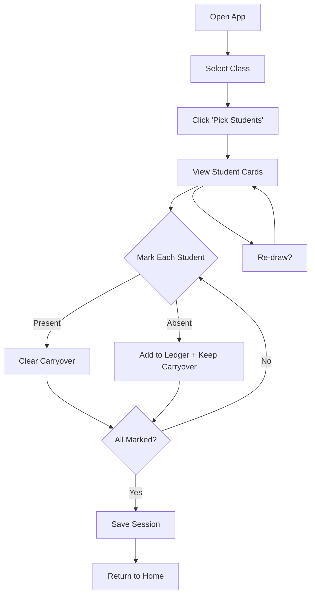

# CheckPoint — High-Level Design Overview

## What is CheckPoint?

**CheckPoint** is a lightweight, offline-first web application for teachers to perform quick attendance spot-checks. Rather than calling roll for an entire class, instructors randomly sample a small subset of students each session while ensuring that previously absent students are automatically rechecked until confirmed present.

---

## Goals

| Goal | Description |
|------|-------------|
| **Speed** | Complete student selection in ≤10 seconds from app launch |
| **Reliability** | Ensure absent students are never forgotten—they carry over until present |
| **Simplicity** | No accounts, no cloud required—runs entirely in the browser |
| **Persistence** | All data persists locally; exportable to CSV for record-keeping |

---

## Core Features

### 1. Multi-Class Support
- Create and switch between multiple classes
- Each class maintains its own roster, history, and settings
- Attendance logic is scoped per class (carryovers do not cross classes)
- Delete a class (Home page) with a local cascade delete of per-class data (students, sessions, ledger, settings, and any draft session in `localStorage`)

### 2. Smart Student Selection
- **Carryovers**: Students with an unresolved absence (most recent absence is more recent than their most recent Present mark, or never marked Present after an absence) automatically appear until cleared
- **Random Sampling**: Weighted random selection of N students from those never marked absent
- **Weighting Logic**:
  - Never-seen students get higher priority (weight 2.0)
  - Students sampled in the last two sessions get reduced weight (0.5 cooldown)

### 3. Session Workflow
1. Select a class and click **Pick Students**
2. Review the displayed students (carryovers + random picks)
3. Mark each student as **Present** or **Absent** (with excused/unexcused reason)
4. **Re-draw** regenerates the random portion (carryovers stay). If you have already marked any students, the app will confirm and **clear marks** before regenerating picks.
5. **Save** finalizes the session and updates all records

### 4. Attendance Tracking
- Absence counts tracked per student
- Absence ledger records every absence with date, reason, and student ID
- Present marks clear carryover status
  - **Note**: Absence counts are derived from the per-class ledger (not cached).

### 5. Data Import/Export
- CSV roster import with header-based fields (missing columns/values are treated as empty)
- Auto-generates stable UUIDs for students missing IDs
- Roster import is **fail-closed** for identity safety: imports are blocked if `studentId` duplicates exist in the CSV or if a `studentId` would collide with an existing student in a different class (current local storage keys students by `id`).
- Per-class absence CSV export for external record-keeping
- Optional Google Sheets integration for cloud backup

---

## Application Layout

```
┌─────────────────────────────────────────────────────────────┐
│  Navigation Bar                                              │
│  [Home] [Session] [History] [Settings] [Roster]             │
├─────────────────────────────────────────────────────────────┤
│                                                              │
│                      Main Content Area                       │
│                                                              │
│   Content varies by page (see below)                        │
│                                                              │
└─────────────────────────────────────────────────────────────┘
```

### Pages

| Page | Purpose |
|------|---------|
| **Home** | Class selection, create new class, launch "Pick Students" |
| **Session** | Active attendance check—display student cards, mark present/absent, save |
| **History** | View past sessions, export absences CSV, delete sessions, correct past marks |
| **Settings** | Configure N (sample size), weight multipliers, CSV output file, Google Sheets sync |
| **Roster** | View roster with derived absence counts (sortable), import CSV |

---

## Data Model

```
┌─────────────┐      ┌─────────────┐      ┌─────────────┐
│   Class     │──1:N─│   Student   │──1:N─│ AbsenceLedger│
│  id, name   │      │ id, classId │      │ studentId    │
│             │      │ displayName │      │ date, reason │
└─────────────┘      └─────────────┘      └─────────────┘
       │                   │
      1:1                 1:N
       ▼                   ▼
┌─────────────────┐  ┌─────────────┐
│PerClassSettings │  │   Session   │
│ defaultN        │  │  id, date   │
│ neverSeenWeight │  │ picks, marks│
│ cooldownWeight  │  │ carryoverIds│
└─────────────────┘  └─────────────┘
```

> **Note**: Absence counts are derived from the ledger, not stored. Carryovers are derived from the ledger + most recent Present marks.

### Key Entities

- **Class**: A course with its own roster and history
- **Student**: Enrolled student with display name and optional metadata (firstName, lastName, loginId, sisId)
- **Session**: A single attendance check event with picks, marks, and timestamps
- **AbsenceLedger**: Append-only log of all absences — **single source of truth**
- **PerClassSettings**: The single local authority for per-class configuration (N, neverSeenWeight, cooldownWeight, Google Sheets ID). The Sheets `Classes.defaultN` column is only a compatibility projection.

---

## Technology Stack

| Layer | Technology |
|-------|------------|
| **Frontend** | React 19 + TypeScript |
| **Build** | Vite 7 with PWA plugin |
| **State** | Zustand |
| **Storage** | IndexedDB via Dexie |
| **CSV** | Papaparse |
| **Routing** | React Router v7 |
| **Styling** | Vanilla CSS with dark theme |

---

## Design Principles

1. **Offline-First**: Entire app works without internet; all data in browser IndexedDB
2. **Local-Only by Default**: No authentication, no server—privacy preserved
3. **Testable Selection**: Weighted random uses a seedable RNG (the app does not set a fixed seed in normal usage)
4. **Append-Only Ledger**: Absences logged immutably for reliable history
5. **Desktop-First, Mobile-Friendly**: Optimized for laptop use, responsive design
6. **Ledger as Single Source of Truth**: Absence counts derived from ledger, not cached
7. **Fail-Closed External Import**: Google Sheets is user-editable, so imports validate strictly and avoid destructive local overwrites on invalid data.
8. **Exclusive Operation-Keyed Status**: One `inFlight` operation key (pick/save/export/import) admits long-running store work and supplies operation-specific UI labels without allowing overlap.

---

## State Management Notes (implementation-aligned)

- **Single authority**
  - `web/src/store.ts` is the orchestration authority for domain operations and external sync.
  - Durable state is in IndexedDB via Dexie (`web/src/data/db.ts`).

- **Exclusive async status**
  - Store tracks one operation key under `inFlight` (`pick`, `save`, `export`, or `import`). A second long-running action and class switching are rejected until the owner releases the slot.
  - The key lets Session and Settings render operation-specific labels while the single admission point prevents cross-page overlap.

- **Sheets import safety**
  - Imports are parsed and validated by `web/src/domain/sheetImport.ts`; Google transport lives in `web/src/services/sheetsClient.ts` and `web/src/services/sheetsSync.ts`.
  - Import is **validate → commit**:
    - Validate Students/Sessions/Marks/Ledger rows.
    - Check referential integrity (e.g., marks/ledger do not reference missing students/sessions).
    - Only then perform the destructive local overwrite transaction.

- **Persisted browser keys**
  - The selected class uses `checkpoint_selected_class`; unsaved sessions use `checkpoint_draft_session_<classId>`.

## Testing

| Type | Tool | Location |
|------|------|----------|
| Unit | Vitest | `web/src/**/*.test.ts` and `web/src/**/*.test.tsx` |
| Browser | Playwright | `web/e2e/*.spec.ts` |

Run: `cd web && npm test`

**Tested modules:**
- `attendance.ts` — carryover computation and weight calculation
- `validation.ts` — entity input validation
- `sheetImport.ts` — fail-closed spreadsheet parsing and referential integrity
- `sessionDraft.ts` — fresh-draw and redraw invariants
- `sampling.ts` — deterministic weighted sampling
- `sheetsClient.ts`, `sheetsSync.ts`, and `store.ts` — external-boundary policy and operation guards

---

## Visual Design

- **Dark Theme**: Deep blue-black background with gradient accents
- **Card-Based UI**: Student cards with clear present/absent toggle buttons
- **Visual Indicators**:
  - Yellow/amber border for carryover students
  - Green background for "Present" selection
  - Red background for "Absent" selection
- **Glassmorphic Navigation**: Semi-transparent sticky nav bar with blur effect

---

## User Flow Diagram



---

## Non-Goals (v1)

The following are explicitly out of scope for the initial version:

- SIS (Student Information System) integration
- Seating charts
- Tardy/late tracking
- Parental notifications
- Advanced analytics
- Multi-user authentication

---

## Future Considerations (v1.1)

- Filters/search in History page
- Roster export
- Better session cancellation/re-draw UX
- Improved offline status UI
